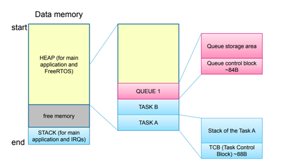

# 📌 Quản lý bộ nhớ Heap trong RTOS

## 📖 Giới thiệu

Trong các hệ điều hành RTOS, việc **cấp phát và quản lý bộ nhớ Heap** cực kỳ quan trọng. Nó ảnh hưởng trực tiếp đến:
- Hiệu suất hệ thống.
- Tính ổn định và **khả năng đáp ứng thời gian thực**.
- Khả năng **tạo và hủy các Task, Semaphore, Queue, Mutex** khi chạy.

## ⚙️ Phân loại cấp phát bộ nhớ

### 1️⃣ Cấp phát tĩnh (Static Allocation)
- Bộ nhớ được cấp phát cố định khi biên dịch.
- ✅ Ưu điểm: Đơn giản, ổn định, không phân mảnh.
- ❌ Nhược điểm: Thiếu linh hoạt, dễ lãng phí nếu không dùng hết.

### 2️⃣ Cấp phát động (Dynamic Allocation)
- Bộ nhớ được cấp phát khi chạy (runtime).
- ✅ Ưu điểm: Linh hoạt, dễ tạo & xóa Task, Queue.
- ❌ Nhược điểm: Dễ gây phân mảnh, phải đảm bảo thread-safe.

> ⚠️ **Lưu ý:** Không nên dùng `malloc()` / `free()` chuẩn C vì:
> - Không đảm bảo thread-safe.
> - Không kiểm soát được thời gian thực thi.
> - Thay vào đó, FreeRTOS dùng `pvPortMalloc()` và `vPortFree()`.

---

## 🗂️ Các phương pháp quản lý Heap trong FreeRTOS

| Phương pháp | Mô tả | Ưu điểm | Nhược điểm |
|-------------|-------|---------|-------------|
| **Heap_1** | Cấp phát đơn giản, **không cho phép giải phóng** | Tốc độ cao, dễ triển khai | Không xóa được Task, Queue, Semaphore |
| **Heap_2** | Giải phóng được, nhưng **không tái sử dụng vùng trống giữa** | Xóa được các đối tượng | Dễ phân mảnh |
| **Heap_3** | Dùng `malloc()`/`free()` của C chuẩn | Linh hoạt, tận dụng thư viện chuẩn | Không thread-safe, cần cấu hình heap qua linker |
| **Heap_4** | Như Heap_2 nhưng **cho phép tái sử dụng vùng free space** | Hạn chế phân mảnh | Cài đặt phức tạp hơn Heap_2 |
| **Heap_5** | Cấp phát từ **nhiều vùng RAM riêng biệt** | Phù hợp hệ thống có nhiều vùng RAM | Cấu hình phức tạp nhất |

---

## ✅ Kết luận

- **Chọn cách quản lý Heap phù hợp** với tài nguyên RAM & yêu cầu thời gian thực.
- Với ứng dụng đơn giản, Heap_1 hoặc Heap_2 đủ dùng.
- Với hệ thống phức tạp, nhiều RAM rời rạc, nên dùng Heap_4 hoặc Heap_5.

---

## 💡 Tài liệu tham khảo

- [FreeRTOS Memory Management Documentation](https://www.freertos.org/a00111.html)

---
