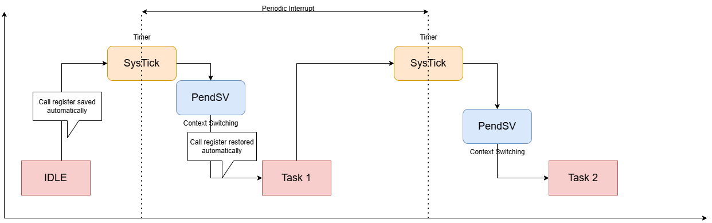
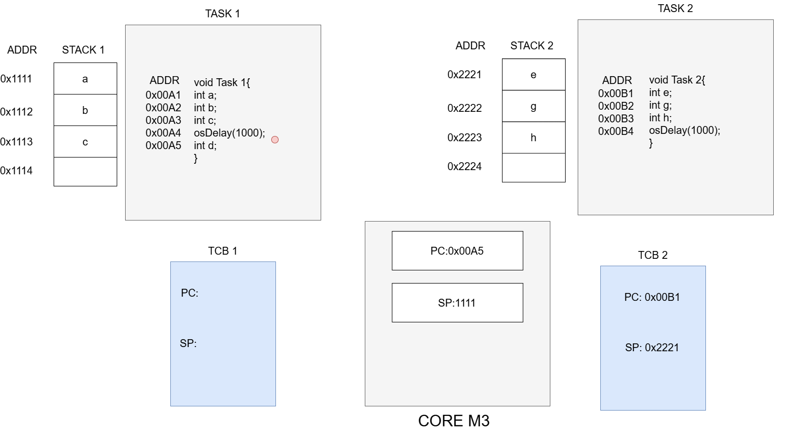
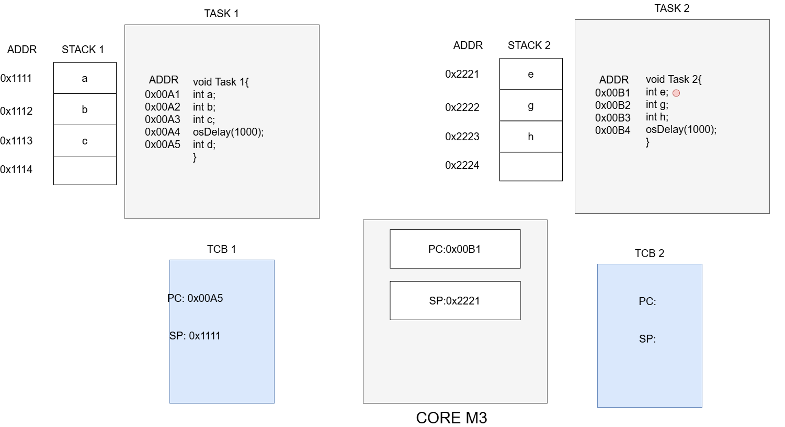

# Context Switching

> Context switch là gì? Context switch là quá trình mà CPU chuyển đổi từ thực thi tiến trình này (process/thread/task) sang thực thi tiến trình khác.

## 1.SysTick
> SysTick là tên viết tắt của System Tick Timer, là một bộ đếm thời gian (timer) tích hợp sẵn trong hầu hết các vi điều khiển ARM Cortex-M (như STM32, NXP, v.v.). Đây là một phần của khối Cortex-M Core Peripherals mà ARM định nghĩa tiêu chuẩn cho các chip sử dụng lõi Cortex-M.

📌 Mục đích của SysTick

- Tạo ra các ngắt định kỳ (periodic interrupt).
- Được dùng để quản lý thời gian hệ thống: như tạo delay, đo thời gian, lập lịch các task trong hệ điều hành RTOS (Real-Time Operating System).
- Là timer cơ bản, dễ dùng, độc lập với các timer ngoại vi khác.

## 2.PendSV
>PendSV là PendSV (Pendable Service Call) là một loại ngắt đặc biệt có sẵn trong lõi ARM Cortex-M (ví dụ STM32, NXP, v.v.).

Nó được thiết kế chuyên biệt cho việc quản lý ngữ cảnh (context switching) trong Hệ điều hành thời gian thực (RTOS).

## 3. Chuyển đổi ngữ cảnh

Trong hình trên, câu lệnh đang thực thi có địa chỉ 0x00A4 của Task 1. Vì thế trong core M3, PC trỏ đến vị trí lệnh tiếp theo là 0x00A5 và SP là địa chỉ đầu tiên của stack 0x1111.
Trạng thái Task 2 đang bị block, TCB 2 giữ địa chỉ của lệnh thực thi tiếp theo của Task 2 là 0x00B1, SP là 0x2221.

Khi có chuyển đổi ngữ cảnh xảy ra, Task 1 bị block,PC và SP trong core M3 hiện tại sẽ được lưu vào trong TCB của Task 1 nhằm lưu lại vị trí lệnh tiếp theo sẽ thực thi khi quay lại Task 1. Trong khi đó PC và SP được lưu trong TCB 2 sẽ được load vào trong CORE M3 để tiếp tục thực thi Task 2.