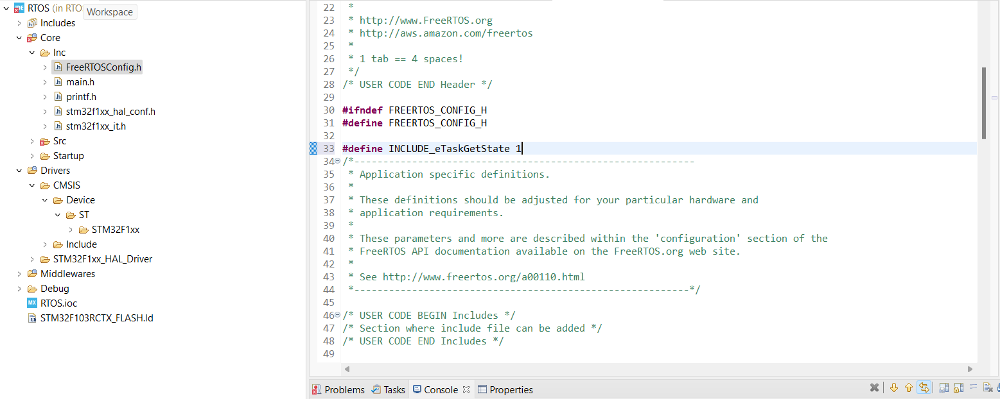
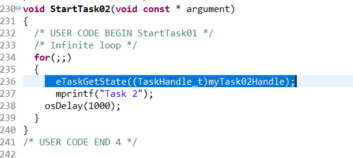
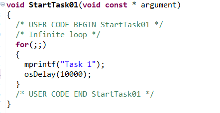
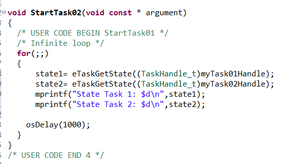
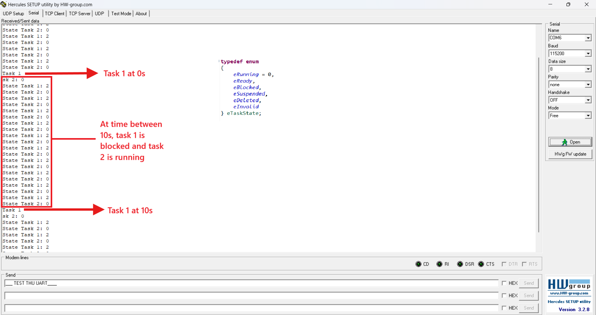

# 🚀 getState RTOS

<!--  -->

> 📌 Because CMSIS RTOS doesn't support API to get state, we need to change into FreeRTOS using eTaskGetState API.

<!-- ---

## 🌟 Tính năng

- 🔍 Phân tích file log định dạng `.log`
- 🎯 Lọc theo mức độ log: `INFO`, `WARN`, `ERROR`
- 📤 Xuất dữ liệu ra định dạng `.csv`, `.json`
- ⚙️ Giao diện dòng lệnh dễ dùng

---

## 🖼️ Giao diện (ví dụ minh họa)


--- -->

## 📥 Setup

### 1. Enable eTaskGetState in file FreeRTOSConfig.h
```c
#define INCLUDE_eTaskGetState 1
```

 
 ### 2. Casting from type osThreadId to TaskHandle_t




## 🖼️ Usage
### 1. Get state of task1 & task2





### 2.Hercules Testing
