# Message Queue / Mail Queue

## 1. Lý thuyết
Hàng đợi (queue) là hình thức chính giao tiếp giữa các tác vụ (task). Chúng có thể được sử dụng để gởi tin nhắn (message) giữa các task với nhau và giữa các task với các ngắt (interrupt). Trong hầu hết trường hợp, chúng được sử dụng làm bộ đệm FIFO (First In First Out) an toàn cho luồng (thread safe FIFO buffer) với dữ liệu mới được gởi tới phía sau của queue, mặc dù dữ liệu cũng có thể được gởi tới phía trước.


Queue hoạt động theo cơ chế FIFO: vào trước ra trước
Khi một Task muốn truyền dữ liệu sang Task khác, nó sẽ đặt dữ liệu này vào Queue, cùng với đó là ID của Task mà nó muốn truyền tới

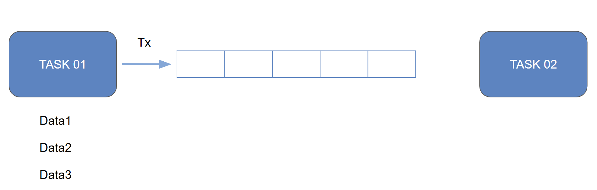
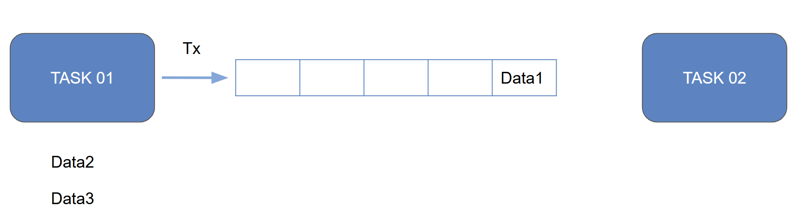
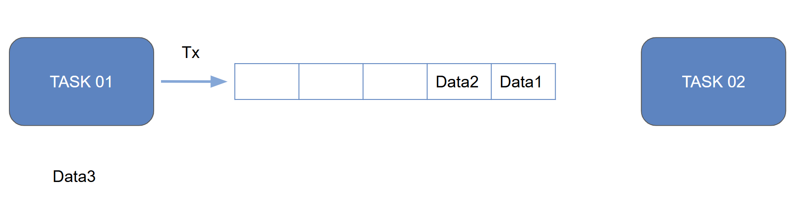
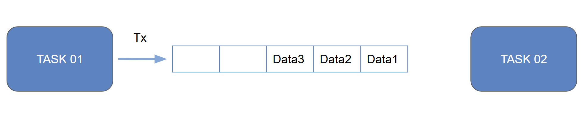
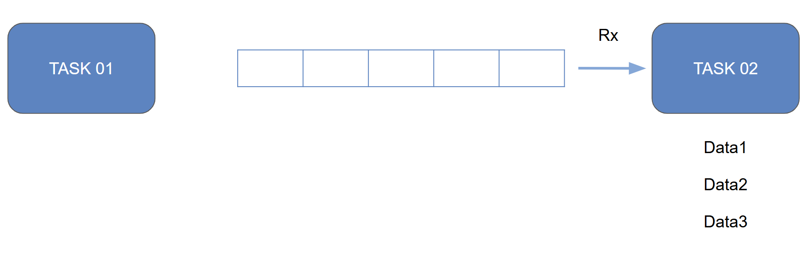

Queue trong RTOS gồm:
```cpp
- Message queue : Truyền dữ liệu dạng đơn
- Mail queue    : Truyền dữ liệu dạng khối
```
Hay hiểu một cách đơn giản thì 
```cpp
- Message queue : Xếp 1 hàng, hay trong lập trình gọi là mảng 1 chiều
- Mail queue    : Xếp nhiều hàng, hay trong lập trình gọi là mảng 2 chiều
```

Queue API
| **Tính năng**                                          | **RTOS API**       |
|--------------------------------------------------------|---------------------|
| Create message queue                                   | `osMessageQCreate`  |
| Get message                                             | `osMessageQGet`     |
| Put message                                             | `osMessageQPut`     |
| Receive message without removing message from queue    | `osMessagePeek`     |
| Create mail queue                                       | `osMailCreate`      |
| Get mail                                                | `osMailGet`         |
| Put mail                                                | `osMailPut`         |
| Allocate memory block for mail queue                   | `osMailAlloc`       |
| Free memory for mail queue                             | `osMailFree`        |

Mail API
| **Tính năng**                                         | **RTOS API**     |
|-------------------------------------------------------|------------------|
| Tạo hàng đợi thư                                      | `osMailCreate`   |
| Lấy thư (blocking hoặc timeout)                       | `osMailGet`      |
| Gửi thư                                               | `osMailPut`      |
| Cấp phát bộ nhớ cho thư                               | `osMailAlloc`    |
| Giải phóng bộ nhớ thư                                 | `osMailFree`     |
| Nhận thư mà không xoá khỏi hàng đợi (không hỗ trợ v1) | *Not Available*  |

> 📎 **Lưu ý**: CMSIS-RTOS v1 không hỗ trợ `osMailPeek`. Nếu cần tính năng xem trước thư mà không xoá khỏi hàng đợi, bạn có thể xem xét sử dụng Message Queue thay thế.

## 2. Code Message Queue
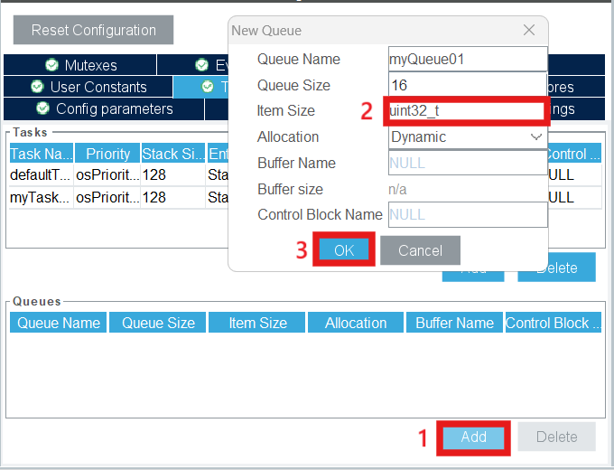


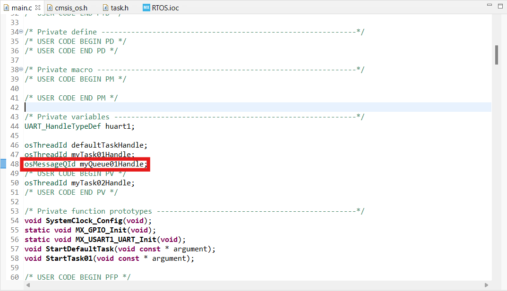
```cpp
osMessageQId myQueue01Handle;
```
B1: Tạo một queue với ID myQueue01Handle.

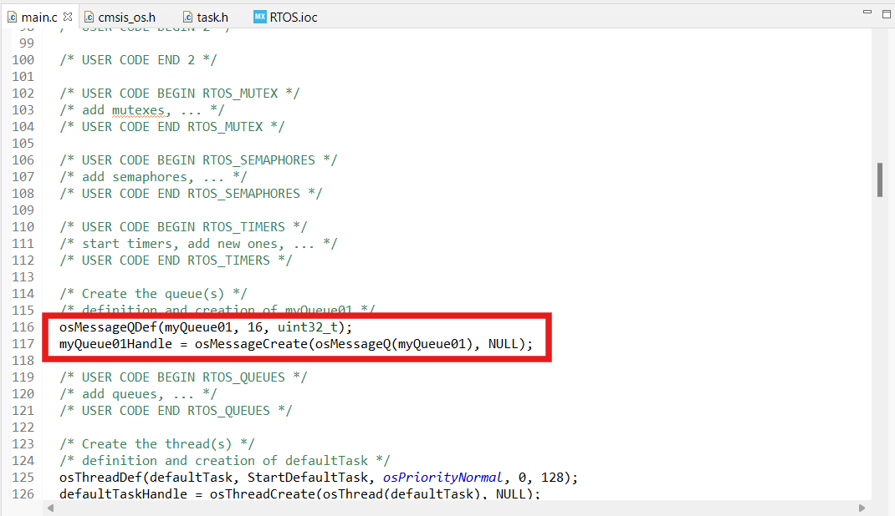
```cpp
 osMessageQDef(name, queue_sz, type);
 osMessageQId osMessageCreate (const osMessageQDef_t *queue_def, osThreadId thread_id);
```
B2: Khởi tạo cho queue

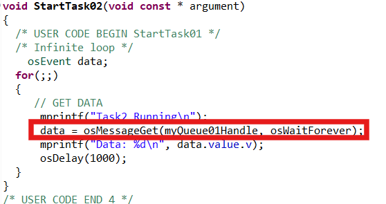
```cpp
osStatus osMessagePut (osMessageQId queue_id, uint32_t info, uint32_t millisec);

```
B3: Code TASK 2 nhận message

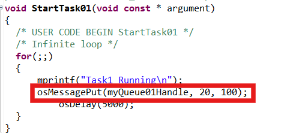
```cpp
osEvent osMessageGet (osMessageQId queue_id, uint32_t millisec);
```
B4: Code TASK 1 gửi message

## 3. Code Mail Queue
  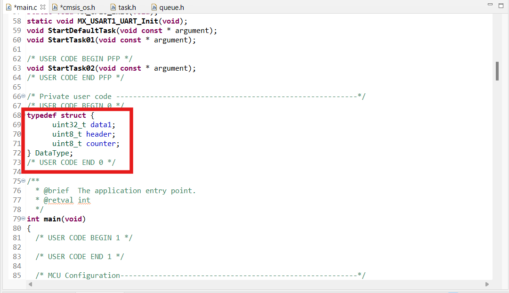
B1: Khai báo struct chứa các dữ liệu
  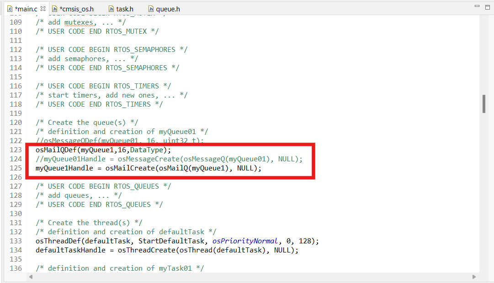
B2: Khởi tạo mail Queue
  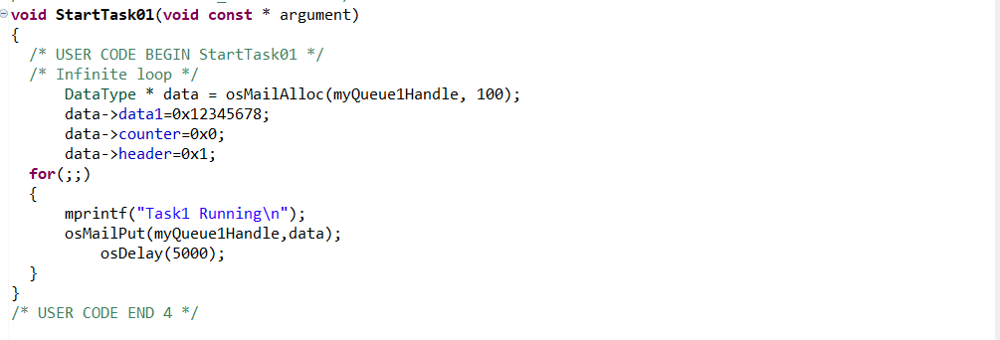
B3: Code TASK 1 gửi message
  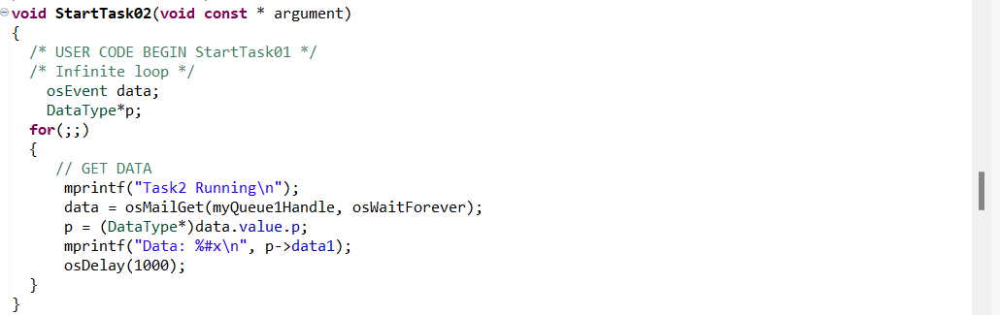
B4: Code TASK 2 nhận message