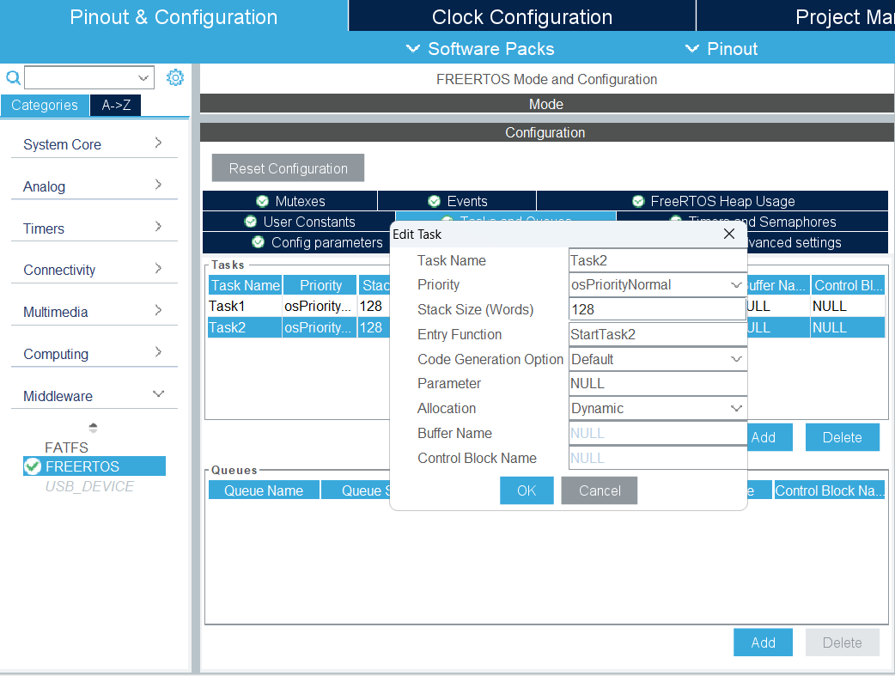
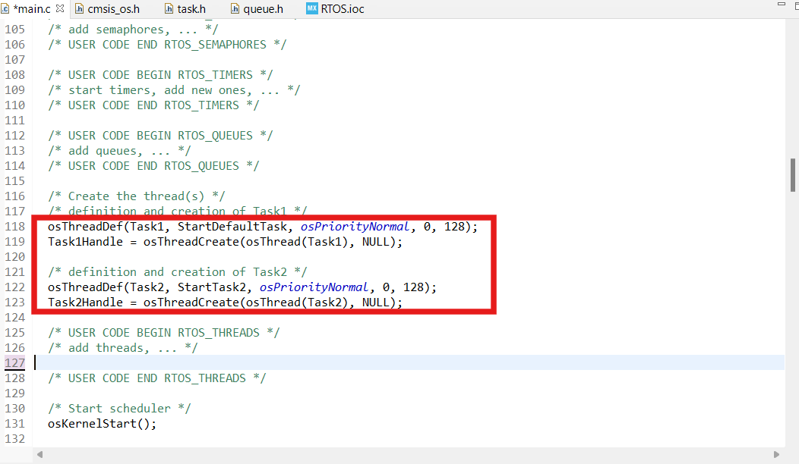
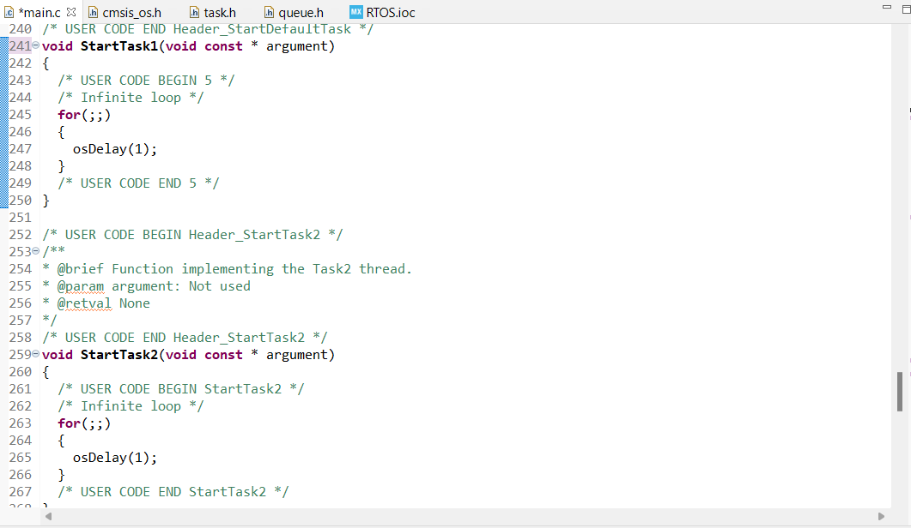

# Tạo Task trong FreeRTOS với STM32CubeMX và STM32 HAL

---

## 1. Cấu hình Task trong STM32CubeMX

Trong phần cấu hình CubeMX:

- Chọn tab `Middleware > FREERTOS`
- Truy cập mục `Tasks and Queues`
- Thêm task mới bằng nút `Add`

Ví dụ, ở đây ta tạo 2 task với các thuộc tính sau:

| Task Name | Entry Function | Priority         | Stack Size (Words) |
|-----------|----------------|------------------|---------------------|
| Task1     | StartTask1     | osPriorityNormal | 128                 |
| Task2     | StartTask2     | osPriorityNormal | 128                 |

Ảnh minh họa:



---

## 2. Khai báo Task Handle trong mã nguồn

CubeMX sẽ tự động sinh ra các biến `osThreadId` để giữ handle cho mỗi task. Các biến này được khai báo trong file `main.c` như sau:

```c
osThreadId Task1Handle;
osThreadId Task2Handle;
```


## 3. Khởi tạo task


## 4. Các function các task
